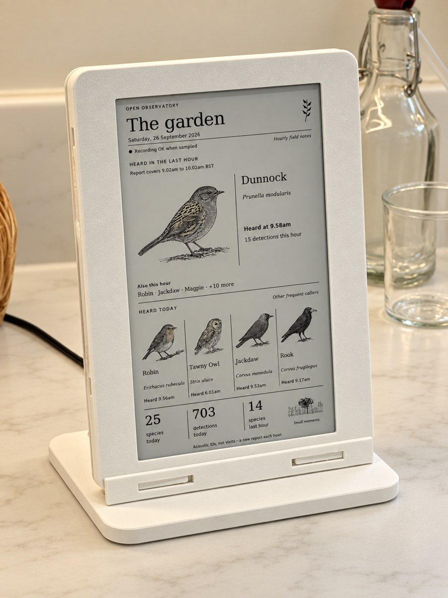
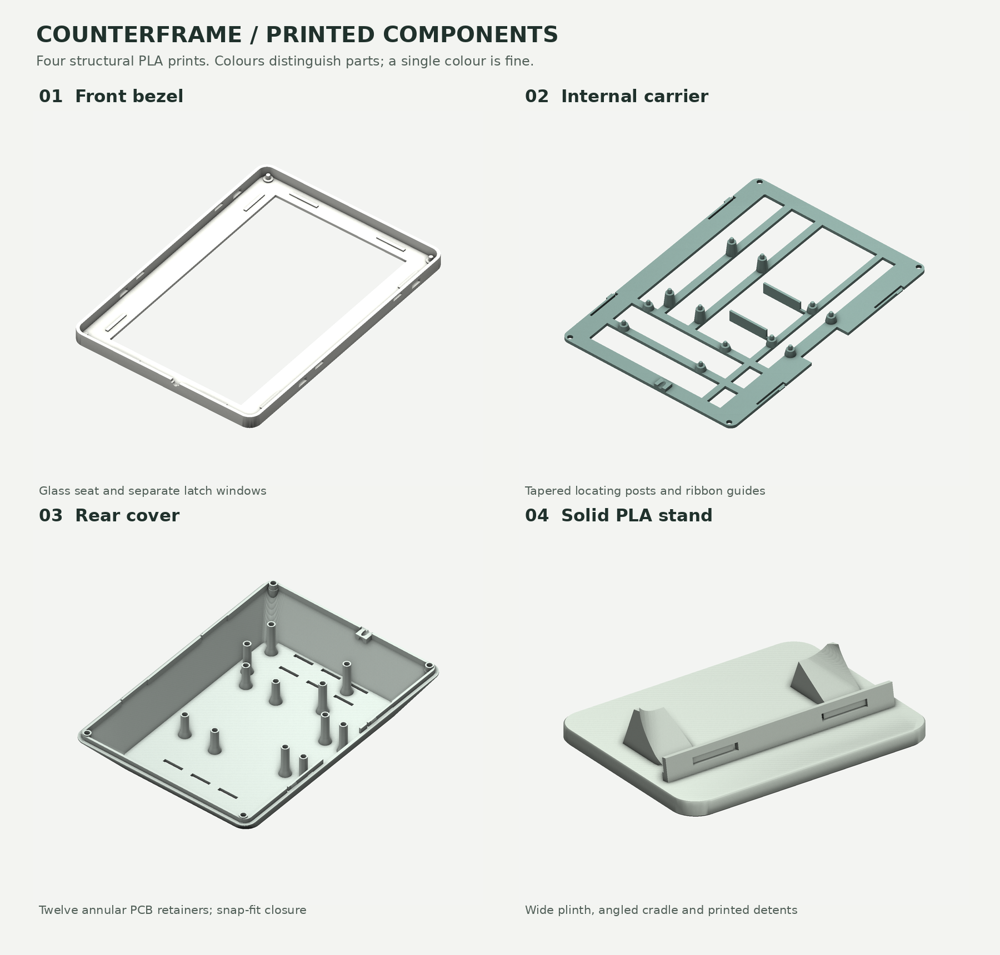
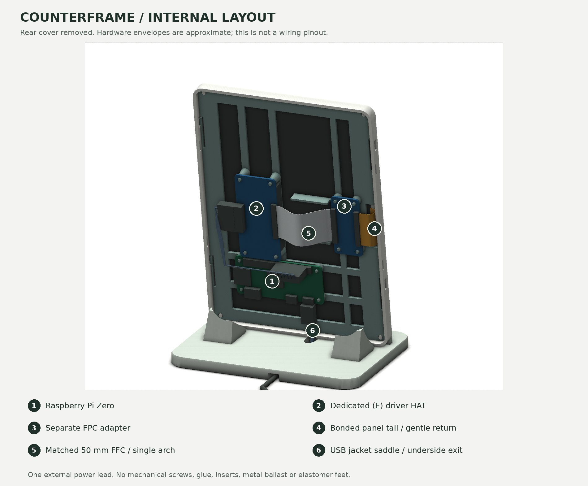

# Open Observatory · Garden Ink

An illustrated e-ink display for [Open Observatory](https://github.com/simonjgreen/OpenObservatory). A Raspberry Pi Zero, a printed frame, and an hourly account of what the garden has been up to.

**Garden Ink is an expansion of Open Observatory and depends on it for its data.** The outdoor station does the listening, identification and review. This is another way to see what it heard, on a screen that can sit in the kitchen and get on with it.

<p align="center"></p>

*The assembled frame, running on the kitchen counter. The birds are illustrations of acoustic identifications.*

## Where the idea came from

I already had an [indoor LCD display for Open Observatory](https://github.com/simonjgreen/OpenObservatory#the-indoor-display): a small ESP32 touchscreen showing what the station was hearing outside. Then I saw [Fugleramme](https://github.com/arnegiacomo/fugleramme) on [Hacker News](https://news.ycombinator.com/item?id=49711544), and thought it'd be nice to have an e-ink version of my existing display. I mentioned [the LCD setup in the discussion](https://news.ycombinator.com/item?id=49719062).

Credit to [arnegiacomo](https://github.com/arnegiacomo) and Fugleramme for the e-ink idea. I already had the listening side working; seeing their bird frame made me want to give it a different sort of display. Garden Ink is the result.

## What it does

- Shows the latest qualifying identification from the last hour, alongside three other frequent species heard today, with wider cards for unusually long names.
- Refreshes on startup, then starts scheduled updates on the hour. `./service.sh refresh` requests an update between scheduled reports; startup and manual pushes retain a saved three-minute minimum between panel attempts. It shows the date and when things were heard; a clock that is wrong for most of the hour would be fairly unhelpful.
- Counts qualifying acoustic detections, with the station's review decisions and source filtering respected. Today starts at local midnight, including when the clocks change. If a scan is incomplete, the totals say so.
- Uses a Waveshare 7.3-inch Spectra 6 **HAT (E)** in 480 × 800 portrait orientation.
- Runs locally with cached artwork. Optional paid image generation is separate and disabled by default.
- Redraws the current page when one of its missing illustrations becomes available, retaining the three-minute panel guard and the regular report schedule.

One bird can produce plenty of detections, so the numbers aren't a count of individual birds or visits.

## The frame

The enclosure is called **Counterframe**. It stands on its own, prints in PLA and goes together without screws. There is one power lead into the Pi; everything else fits inside.

These are the four printed parts laid out before assembly: the front bezel, internal carrier, rear cover and stand.



With the back removed, you can see where the Pi, display driver and adapter sit, and how the ribbon and power cable fit around them.



Both images are CAD renders from the [frame build guide](hardware/counterframe/README.md). The cable colours show the route through the case; use the [wiring table](docs/design/MECHANICAL.md#project-wiring) for the actual connections. The [OpenSCAD source and printable parts](hardware/counterframe/) are included.

## Requirements

You need a running [Open Observatory station](https://github.com/simonjgreen/OpenObservatory) that the display Pi can reach. Garden Ink reads its `/api/v1/health` and `/api/v1/detections` endpoints. The station is a separate installation; the [API contract](display/docs/API_CONTRACT.md) describes what the display expects from it.

The display requires a Pi Zero, Raspberry Pi OS, the specific HAT (E) panel and SPI wiring. Other Waveshare variants are not interchangeable. Workstation previews require Python 3.9+, Pillow and DejaVu fonts, with no station or API key.

## Try it on a workstation

```bash
git clone https://github.com/simonjgreen/OpenObservatory-GardenInk.git
cd OpenObservatory-GardenInk
python3 -m venv .venv
.venv/bin/python -m pip install -r requirements-dev.txt
make test PYTHON=.venv/bin/python
make preview PYTHON=.venv/bin/python
```

On Debian/Ubuntu, install `python3-venv`, `fonts-dejavu-core` and `fonts-dejavu-extra` if needed. Then open `local/previews/no-clock.png` to see the actual 480 × 800 output with labelled sample observations. You can try this without a panel, a live station or an API key.

## Install on a Pi

Copy `display/` to `~/garden_ink` on a fresh Pi, then run as the normal Pi user:

```bash
cd ~/garden_ink
./install.sh http://YOUR-STATION:8080
./run.sh --check
./run.sh --once
./service.sh install
```

For an existing device, first follow [deployment and backup](docs/operations/DEPLOYMENT.md). Preserve configuration, curated artwork, credentials, refresh state and the artwork spending ledger.

## Artwork

The original [robin](art_studio/reference/robin.png) is the reference for the ink-and-wash style. There are 47 bundled images, and the consistency still needs work. The workstation studio has a 53-species catalogue, with generation, review, approval and export. If you already have generated artwork, import it before paying to make it again.

The display works without an OpenAI key. New image generation is optional and paid, and the results need looking at: successfully producing a PNG says very little about whether the bird has the right number of legs. See the [artwork workflow](docs/artwork/WORKFLOW.md), [local recovery](docs/operations/LOCAL_RECOVERY.md) and [optional automatic artwork](docs/operations/AUTOART.md).

## Project layout

| Path | Contents |
|---|---|
| `display/` | Pi application, hardware driver, bundled illustrations and display tests |
| `art_studio/` | Workstation artwork tool and original style reference |
| `hardware/counterframe/` | OpenSCAD master, printable parts and illustrated build guide |
| `design/` | Selected visual reference and current renderer baseline |
| `docs/` | Current architecture, setup, maintenance and design guidance |
| `tests/`, `tools/` | Offline regression suites and development helpers |

The [documentation map](docs/INDEX.md) points to the detail. Next I want to improve the content, refresh timing, readability, power consumption and artwork. [Status and roadmap](docs/STATUS_AND_BACKLOG.md) records what works and what still needs checking.

## Contributing and licensing

See [CONTRIBUTING.md](CONTRIBUTING.md) for local checks and [SECURITY.md](SECURITY.md) for private reporting. Software is MIT-licensed; the enclosure is CC0. Artwork, photographs and third-party notices have separate terms described in [LICENSE.md](LICENSE.md).
